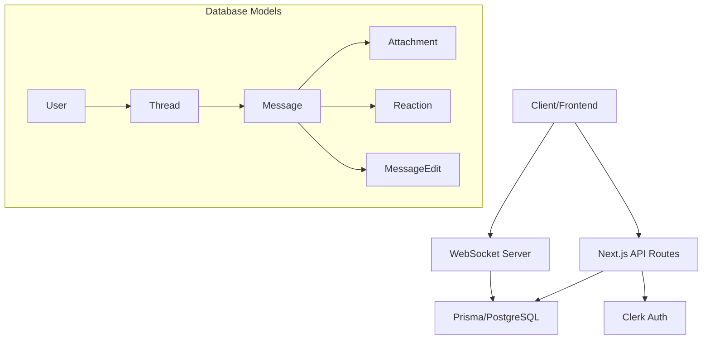
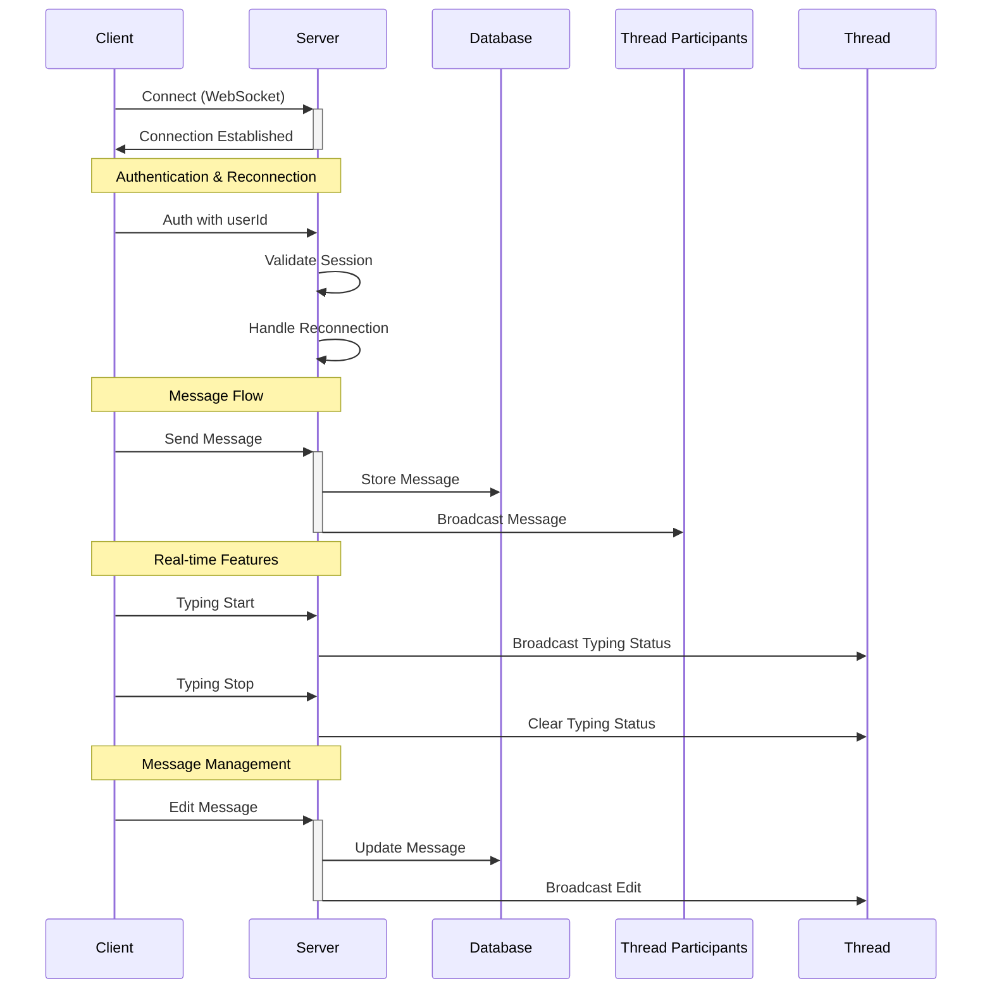

# Chat Application Architecture

## Overview
This document outlines the architecture of our real-time chat application built with Next.js, Prisma, PostgreSQL, and Clerk authentication.

## System Architecture



## Core Components

### 1. Authentication (Clerk)
- User management and authentication
- Session handling
- Profile management with customizable user profiles
- Secure authentication flows

### 1.1 User Model Architecture
- Clerk manages authentication state and user identity
- Local User model maintains application-specific data:
  ```
  Clerk User (auth)        Local User (app data)
  ├─ Identity             ├─ Application ID
  ├─ Auth state          ├─ Message history
  ├─ Sessions            ├─ Thread participation
  └─ Security            └─ User preferences
  ```
- Synchronization via webhooks ensures consistency
- Clerk ID serves as the source of truth for user identity
- This separation allows:
  - Independent scaling of auth and app data
  - Reduced vendor lock-in
  - Better performance for frequent app operations

### 1.2 Role-Based Access Control
- System-wide roles:
  - OWNER: Full system access
  - ADMIN: Moderation and management
  - MEMBER: Standard user access

- Thread-level roles:
  - OWNER: Can delete thread, manage participants
  - ADMIN: Can moderate messages, add/remove participants
  - MEMBER: Can send messages, view history

- Permission inheritance:
  - System OWNER has OWNER rights in all threads
  - System ADMIN has ADMIN rights in all threads
  - Default role is MEMBER

### 2. Frontend Interface

```
┌─────────────────────────────────────────────┐
│ Chat App                                    │
├─────────────┬───────────────────────────────┤
│ Threads     │ Current Thread                │
│ List        │ ┌─────────────────────────┐   │
│ ┌────────┐  │ │ Message History         │   │
│ │Thread 1 │  │ │                        │   │
│ │Thread 2 │  │ │ User1: Message         │   │
│ │Thread 3 │  │ │ User2: Reply           │   │
│ └────────┘  │ │                        │   │
│             │ └─────────────────────────┘   │
│             │ ┌─────────────────────────┐   │
│             │ │ Message Input           │   │
│             │ │ [Type message...]  [Send]   │
│             │ └─────────────────────────┘   │
└─────────────┴───────────────────────────────┘
```

### 3. Message Features
- Real-time messaging using WebSocket
- Message editing capabilities
- Emoji reactions
- File attachments (images, videos, documents)
- Threaded conversations/replies
- Message status tracking

### 4. Data Flow



## Technical Stack

### Frontend
- Next.js for React framework
- TailwindCSS for styling
- WebSocket client for real-time features
- React hooks for state management

### Backend
- Next.js API routes
- Prisma ORM for database operations
- PostgreSQL database
- WebSocket server with reconnection handling
- Rate limiting middleware
- Socket.io for real-time communication

### Database Schema
The application uses the following main models:
- User (managed by Clerk)
- Thread (chat rooms)
- Message
- Attachment
- Reaction
- MessageEdit
- ThreadParticipant
- Notification
- Session

## Real-time Features
- Live message updates
- Message status indicators
- Typing indicators
- Online presence tracking
- Immediate reaction updates

## Security Considerations
- Authentication handled by Clerk
- Socket authentication middleware
- Rate limiting on socket events
- Input sanitization
- File upload restrictions
- Socket reconnection security

## Scalability
- Database indexing for quick lookups
- Connection pooling
- Efficient WebSocket management
- Optimized database queries
- Caching strategies

## Development Guidelines
1. Follow TypeScript best practices
2. Maintain consistent code formatting
3. Write unit tests for critical components
4. Document API endpoints
5. Use proper error handling
6. Follow Git workflow best practices

## Deployment
- Vercel for Next.js hosting
- PostgreSQL on managed service
- WebSocket server on dedicated instance
- CDN for static assets
- Regular database backups 