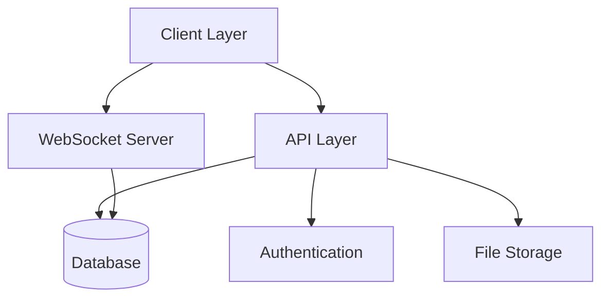

# Chat Application Documentation

## Core Documentation Structure

### 1. Architecture
- [System Overview](architecture/system-overview.md)
- [Data Flow](architecture/data-flow.md)
- [Component Interaction](architecture/component-interaction.md)

### 2. Technical Specifications
- [Types and Interfaces](types/index.md)
  - Core types
  - Component interfaces
  - API types
  - Database models
  - Security types
- [API Specification](api/index.md)
  - Endpoints
  - WebSocket events
  - Response formats
  - Error handling
- [Database Schema](database/schema.md)
  - Table definitions
  - Relationships
  - Indexes
  - Migrations

### 3. Implementation Guides
- [Setup and Deployment](guides/setup.md)
  - Prerequisites
  - Development setup
  - Production deployment
  - Health checks
- [Security Implementation](guides/security.md)
  - Authentication
  - Authorization
  - Data privacy
  - Monitoring
- [Error Handling](guides/errors.md)
  - Error taxonomy
  - Recovery procedures
  - Logging
  - Monitoring

### 4. Development Standards
- [Code Style](standards/code-style.md)
- [Testing Requirements](standards/testing.md)
- [Documentation Guidelines](standards/documentation.md)
- [Git Workflow](standards/git-workflow.md)

## Quick Start

1. Environment Setup
```bash
git clone <repository-url>
cd chatapp
npm install
cp .env.example .env.local
# Configure environment variables
npm run dev
```

2. Key URLs
- Development: http://localhost:3000
- API Documentation: http://localhost:3000/api/docs
- Health Check: http://localhost:3000/api/health

3. Essential Commands
```bash
npm run dev          # Start development server
npm run build       # Build for production
npm run start       # Start production server
npm run test        # Run tests
npm run lint        # Run linter
```

## Architecture Overview



## Key Technologies

- Frontend: Next.js 14, React, TailwindCSS
- Backend: Node.js, Socket.IO
- Database: PostgreSQL, Prisma ORM
- Authentication: Clerk
- Testing: Jest, React Testing Library
- CI/CD: GitHub Actions

## Development Workflow

1. Feature Development
   - Branch naming: `feature/description`
   - PR requirements
   - Review process

2. Testing Requirements
   - Unit tests
   - Integration tests
   - E2E tests

3. Deployment Process
   - Staging deployment
   - Production release
   - Rollback procedures

## Support and Maintenance

1. Monitoring
   - Application health
   - Performance metrics
   - Error tracking

2. Security
   - Vulnerability scanning
   - Dependency updates
   - Security patches

3. Backup and Recovery
   - Database backups
   - Disaster recovery
   - Data retention 