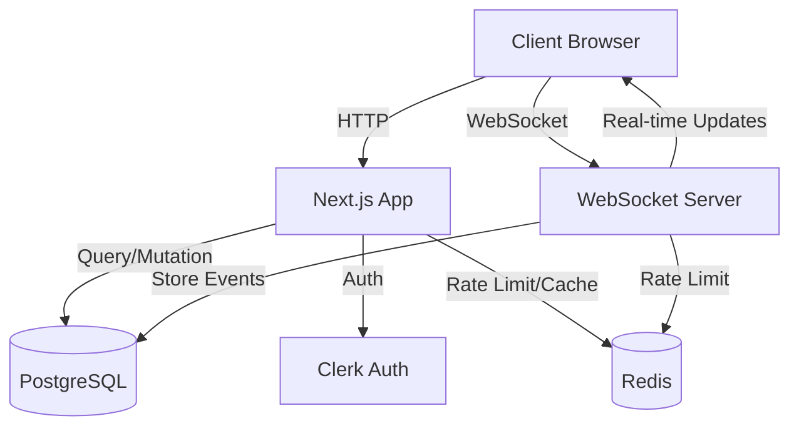
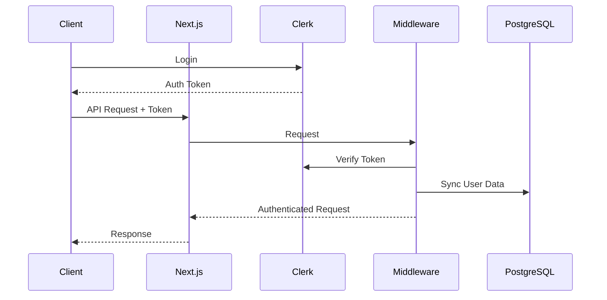
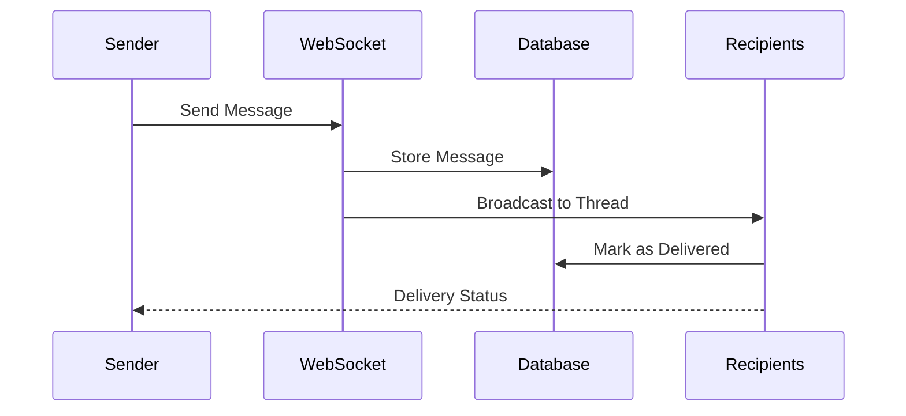
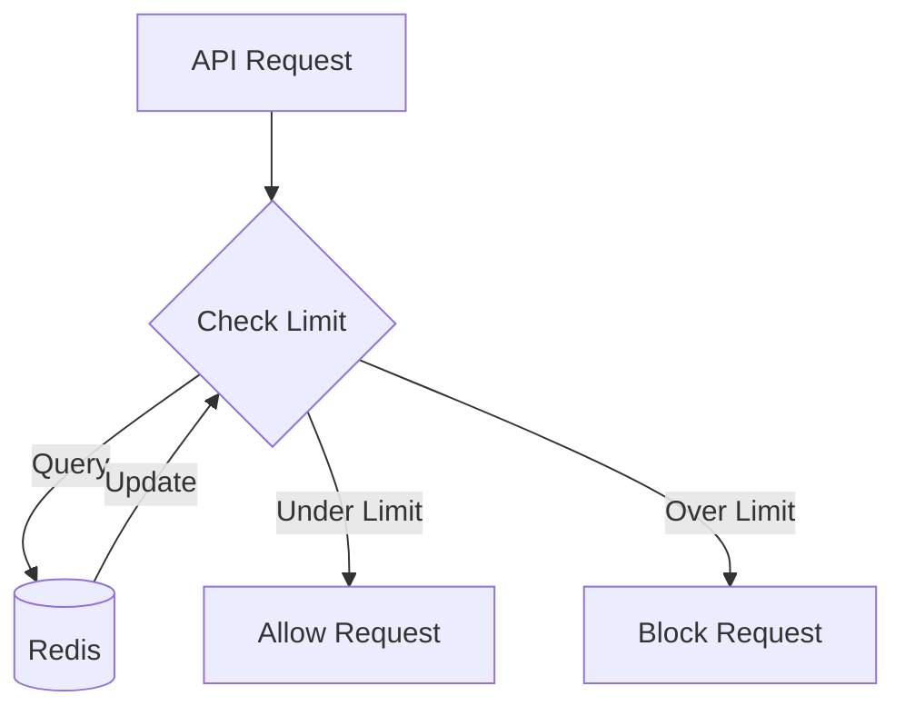
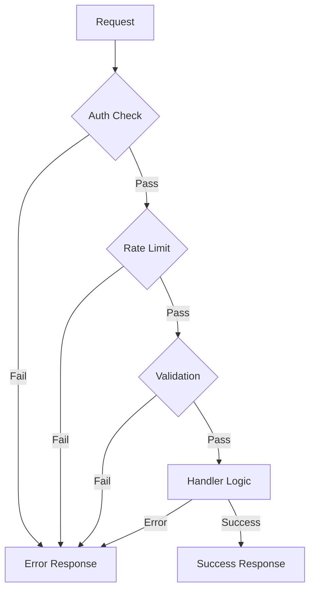
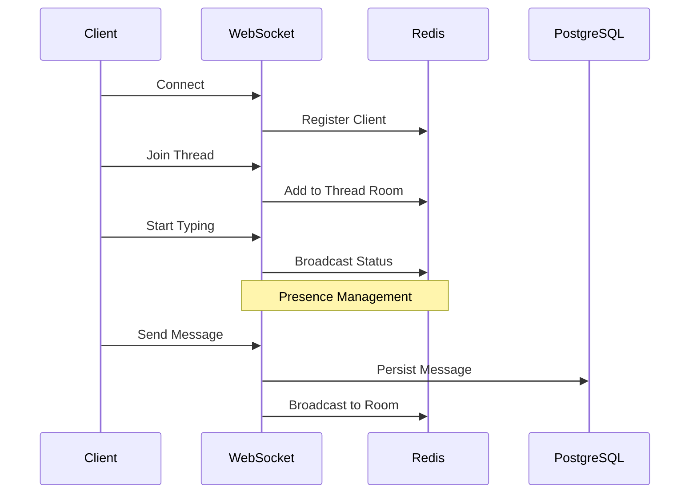
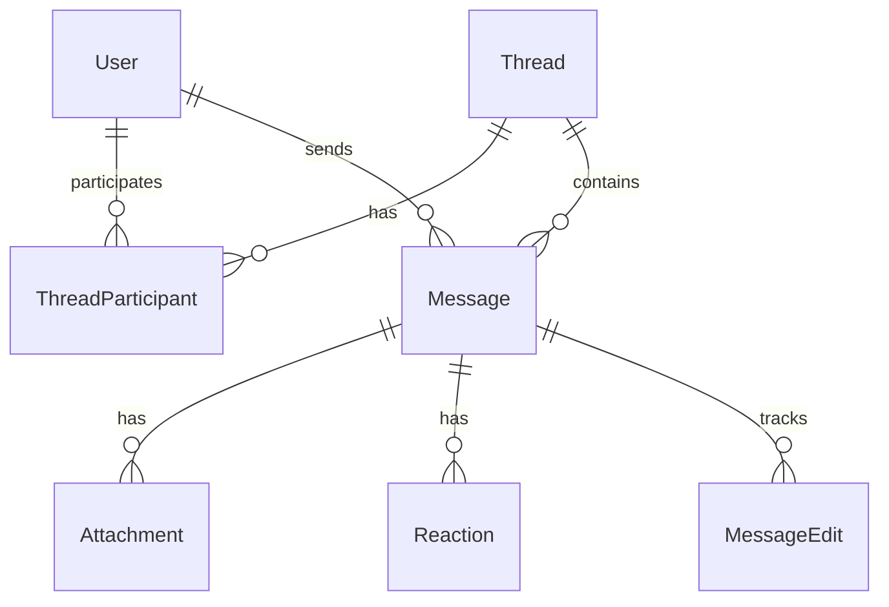
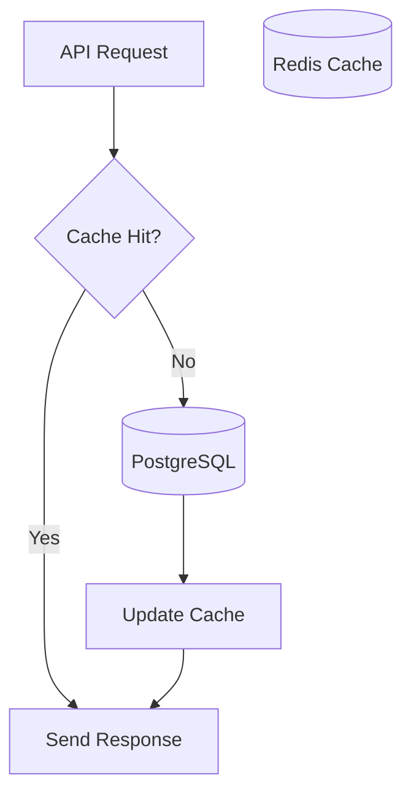

# Data Flow Diagrams

## System Overview

```mermaid
graph TD
    Client[Client Browser]
    NextApp[Next.js App]
    WSServer[WebSocket Server]
    Auth[Clerk Auth]
    DB[(PostgreSQL)]
    Cache[(Redis)]

    Client -->|HTTP| NextApp
    Client -->|WebSocket| WSServer
    NextApp -->|Query/Mutation| DB
    NextApp -->|Auth| Auth
    NextApp -->|Rate Limit/Cache| Cache
    WSServer -->|Real-time Updates| Client
    WSServer -->|Store Events| DB
    WSServer -->|Rate Limit| Cache
```

## Authentication Flow

```mermaid
sequenceDiagram
    participant C as Client
    participant N as Next.js
    participant Clk as Clerk
    participant M as Middleware
    participant DB as PostgreSQL

    C->>Clk: Login
    Clk-->>C: Auth Token
    C->>N: API Request + Token
    N->>M: Request
    M->>Clk: Verify Token
    M->>DB: Sync User Data
    M-->>N: Authenticated Request
    N-->>C: Response
```

## Message Flow

```mermaid
sequenceDiagram
    participant S as Sender
    participant WS as WebSocket
    participant DB as Database
    participant R as Recipients

    S->>WS: Send Message
    WS->>DB: Store Message
    WS->>R: Broadcast to Thread
    R->>DB: Mark as Delivered
    R-->>S: Delivery Status
```

## Rate Limiting

```mermaid
graph TD
    Request[API Request]
    Redis[(Redis)]
    Check{Check Limit}
    Allow[Allow Request]
    Block[Block Request]

    Request --> Check
    Check -->|Query| Redis
    Redis -->|Update| Check
    Check -->|Under Limit| Allow
    Check -->|Over Limit| Block
```

## Error Handling

```mermaid
graph TD
    Request[Request]
    Auth{Auth Check}
    Rate{Rate Limit}
    Valid{Validation}
    Handler[Handler Logic]
    Error[Error Response]
    Success[Success Response]

    Request --> Auth
    Auth -->|Fail| Error
    Auth -->|Pass| Rate
    Rate -->|Fail| Error
    Rate -->|Pass| Valid
    Valid -->|Fail| Error
    Valid -->|Pass| Handler
    Handler -->|Error| Error
    Handler -->|Success| Success
```

## Real-time Event Flow

```mermaid
sequenceDiagram
    participant C as Client
    participant WS as WebSocket
    participant R as Redis
    participant DB as PostgreSQL

    C->>WS: Connect
    WS->>R: Register Client
    C->>WS: Join Thread
    WS->>R: Add to Thread Room
    C->>WS: Start Typing
    WS->>R: Broadcast Status
    Note over WS,R: Presence Management
    C->>WS: Send Message
    WS->>DB: Persist Message
    WS->>R: Broadcast to Room
```

## Database Relations

```mermaid
erDiagram
    User ||--o{ ThreadParticipant : "participates"
    Thread ||--o{ ThreadParticipant : "has"
    Thread ||--o{ Message : "contains"
    User ||--o{ Message : "sends"
    Message ||--o{ Attachment : "has"
    Message ||--o{ Reaction : "has"
    Message ||--o{ MessageEdit : "tracks"
```

## Caching Strategy

```mermaid
graph TD
    Request[API Request]
    Cache[(Redis Cache)]
    DB[(PostgreSQL)]
    Check{Cache Hit?}
    Update[Update Cache]
    Respond[Send Response]

    Request --> Check
    Check -->|Yes| Respond
    Check -->|No| DB
    DB --> Update
    Update --> Respond
``` 