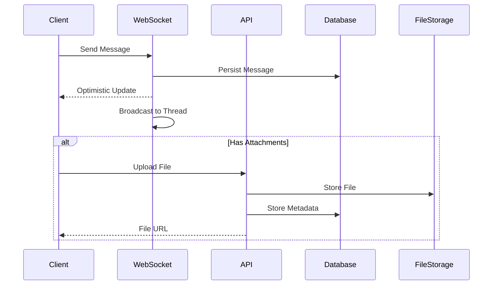
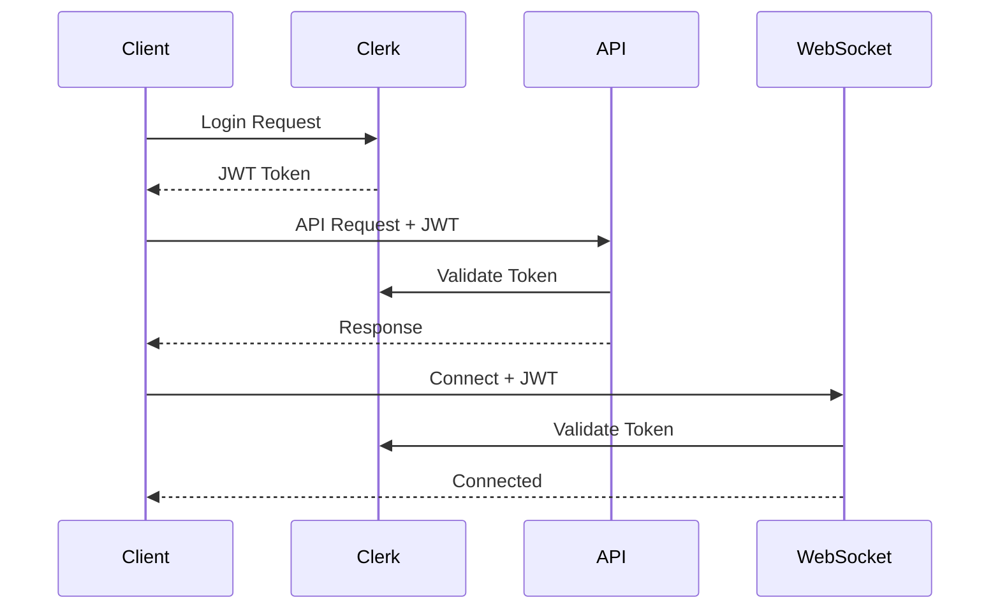
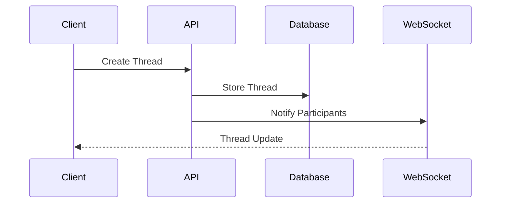

# Data Flow Architecture

## Core Data Flows

### 1. Message Flow


### 2. Authentication Flow


### 3. Thread Management Flow


## Data Consistency

### 1. Optimistic Updates
- Client updates UI immediately
- Server confirms change
- Rollback on failure
- Version tracking for conflicts

### 2. Real-time Sync
```typescript
interface SyncState {
  version: number;
  lastSyncedAt: string;
  pendingOperations: Operation[];
}

interface Operation {
  type: 'create' | 'update' | 'delete';
  resource: string;
  data: any;
  timestamp: string;
}
```

### 3. Conflict Resolution
- Last-write-wins for simple updates
- Three-way merge for complex changes
- Client-side conflict resolution UI
- Server-side validation

## State Management

### 1. Client State
```typescript
interface ClientState {
  user: {
    current: User;
    online: boolean;
    preferences: UserPreferences;
  };
  threads: {
    active: Thread[];
    archived: Thread[];
    unread: number;
  };
  messages: {
    byThread: Record<string, Message[]>;
    pending: Message[];
    failed: Message[];
  };
  ui: {
    activeThread: string | null;
    loadingStates: Record<string, boolean>;
    errors: Error[];
  };
}
```

### 2. Server State
```typescript
interface ServerState {
  connections: {
    userId: string;
    socketId: string;
    lastActivity: Date;
    subscriptions: string[];
  }[];
  rateLimits: {
    [key: string]: {
      count: number;
      resetAt: Date;
    };
  };
  caches: {
    messages: LRUCache<string, Message>;
    threads: LRUCache<string, Thread>;
    users: LRUCache<string, User>;
  };
}
```

## Data Persistence

### 1. Database Operations
- Connection pooling
- Prepared statements
- Transaction management
- Cascade operations

### 2. Caching Strategy
```typescript
interface CacheConfig {
  messages: {
    maxSize: number;    // 1000
    ttl: number;        // 5 minutes
    updateOnRead: boolean;
  };
  threads: {
    maxSize: number;    // 100
    ttl: number;        // 15 minutes
    updateOnRead: boolean;
  };
  users: {
    maxSize: number;    // 500
    ttl: number;        // 30 minutes
    updateOnRead: boolean;
  };
}
```

### 3. File Storage
- Direct upload to storage
- Signed URLs for access
- Metadata in database
- Cleanup of orphaned files

## Performance Considerations

### 1. Message Delivery
- Maximum payload size: 100KB
- Batch updates when possible
- Compress payloads > 10KB
- Rate limit per client: 60/minute

### 2. Connection Management
- Max connections per user: 5
- Heartbeat interval: 30s
- Reconnection backoff: exponential
- Connection timeout: 120s

### 3. Database Load
- Max connections: 20
- Query timeout: 5s
- Slow query threshold: 1s
- Index usage monitoring 