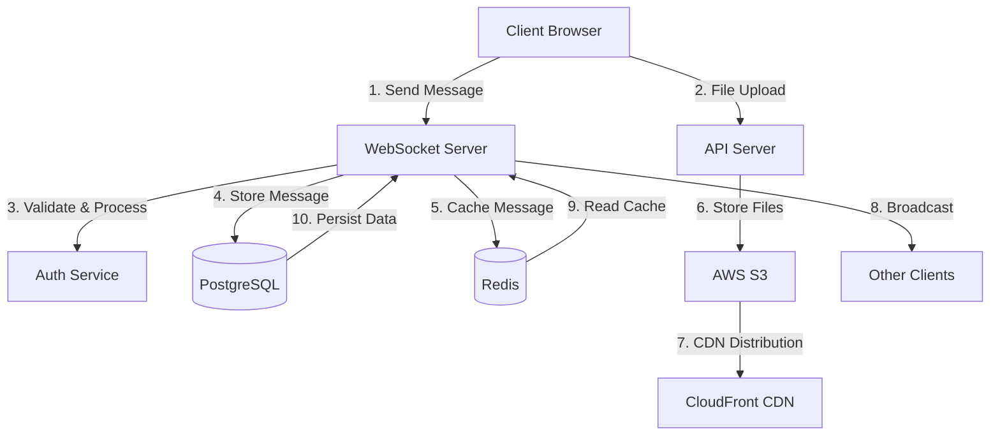
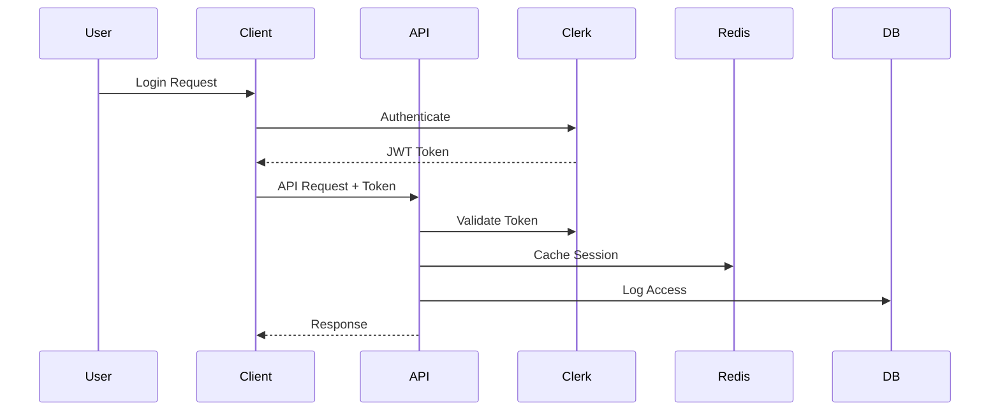
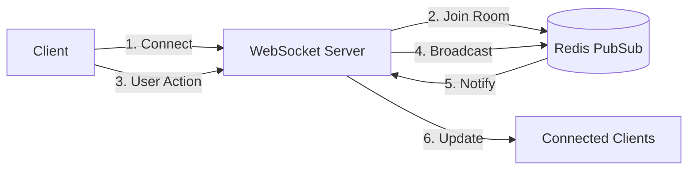
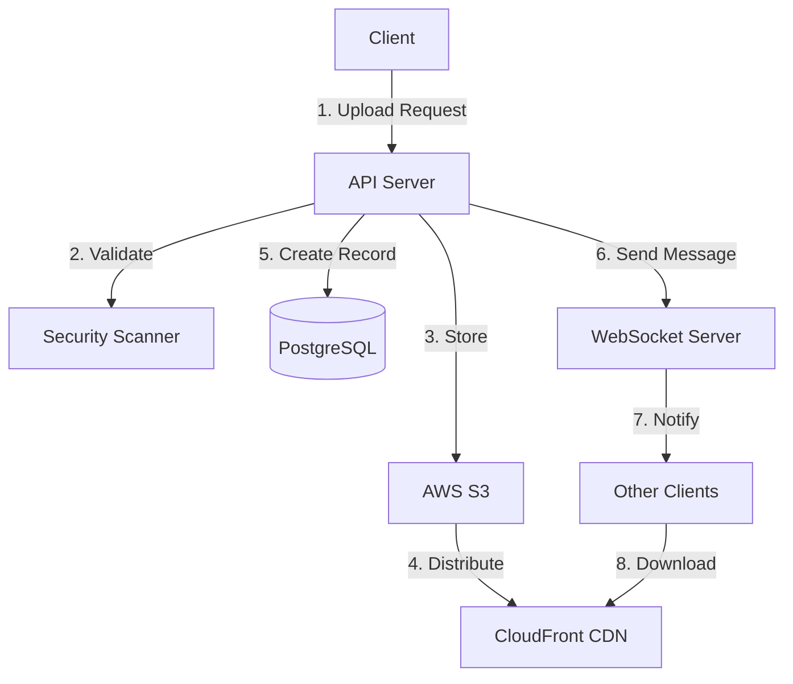
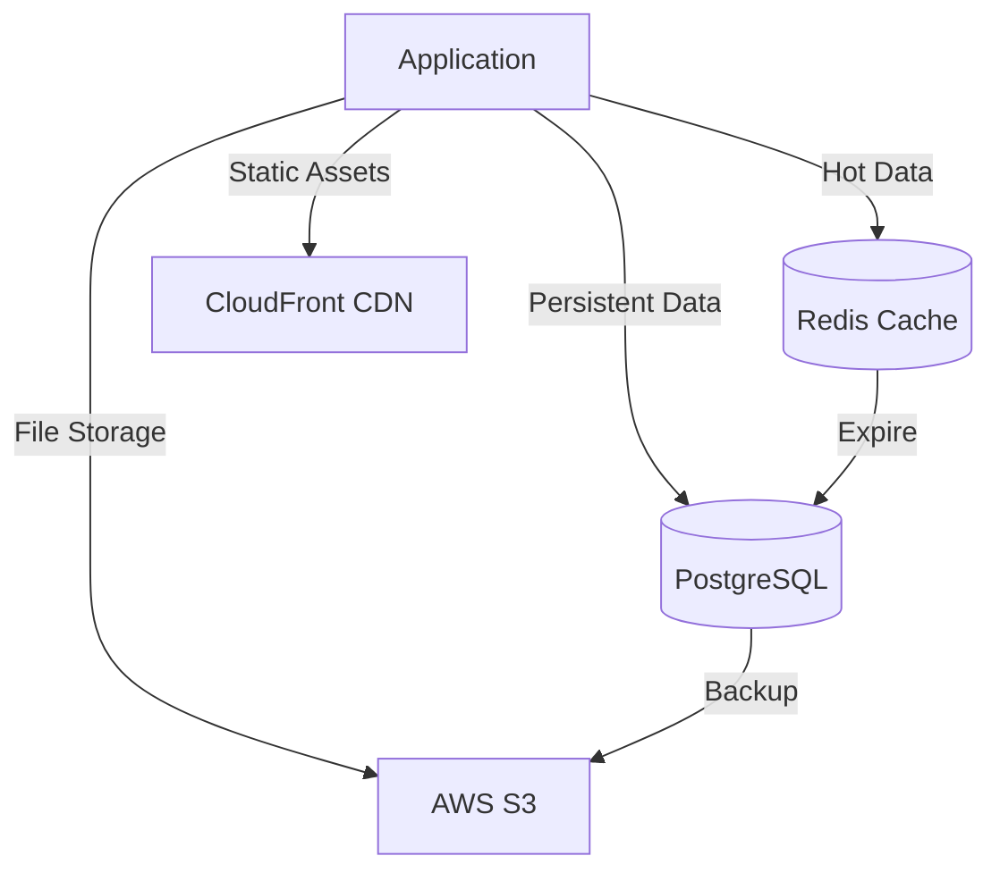

# Data Flow Documentation

## System Overview

The chat application uses a multi-layered architecture with real-time communication capabilities. Below are the key data flows in the system.

## Message Flow

## Authentication Flow

## Real-time Updates Flow

## File Handling Flow

## Data Storage Hierarchy

## Key Components

1. **Client Layer**
   - Next.js Frontend
   - React Components
   - WebSocket Client
   - Service Workers

2. **API Layer**
   - REST Endpoints
   - WebSocket Server
   - File Processing
   - Authentication

3. **Service Layer**
   - Message Processing
   - File Handling
   - User Management
   - Thread Management

4. **Storage Layer**
   - PostgreSQL (Primary Data)
   - Redis (Caching/PubSub)
   - S3 (File Storage)
   - CloudFront (CDN)

## Performance Considerations

- Redis caching for frequently accessed data
- WebSocket connection pooling
- CDN for static assets and files
- Database query optimization
- Message batching and throttling 