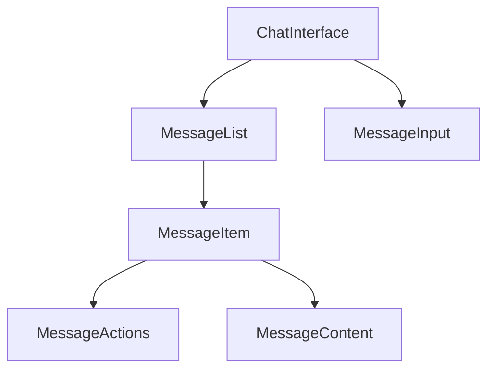

# Chat Components

## Component Hierarchy



## ChatInterface

The main container component managing real-time message flow and user interactions.

### Key Features
- WebSocket connection management
- Message sending/receiving
- Optimistic updates
- Error handling
- Loading states

### Usage
```tsx
<ChatInterface
  threadId="123"
  currentUser={user}
  initialMessages={messages}
  users={userMap}
/>
```

## MessageList

Renders a scrollable list of messages with grouping and infinite loading.

### Key Features
- Message grouping by sender/time
- Infinite scroll
- Loading states
- Optimistic updates
- Scroll position management

### Message Grouping Rules
1. Group consecutive messages from same sender within 5 minutes
2. Show timestamp for first message in group
3. Show avatar for first message in group

## MessageItem

Individual message component supporting various states and interactions.

### States
- Normal
- Optimistic
- Error
- Editing
- Deleted

### Features
- Text content with markdown
- File attachments
- Edit/Delete actions
- Reply functionality
- Error retry
- Status indicators

## Common Patterns

### Loading States
- Skeleton loaders for initial load
- Spinners for operations
- Disabled states during actions
- Connection status indicators

### Error Handling
- Toast notifications
- Retry mechanisms
- Fallback UI
- Error boundaries

### Optimistic Updates
- Temporary IDs
- Immediate UI updates
- Status tracking
- Error recovery

## State Management

### Socket Events
```typescript
// Incoming
'message:new'
'message:updated'
'message:deleted'
'typing:update'
'presence:update'

// Outgoing
'message:send'
'typing:start'
'typing:stop'
'presence:ping'
```

### Local State
- Messages array
- Loading states
- Error states
- Connection status
- Optimistic updates

## Dependencies
- TailwindCSS for styling
- shadcn/ui components
- socket.io-client
- Custom hooks (useSocket, useOptimisticMessages) 