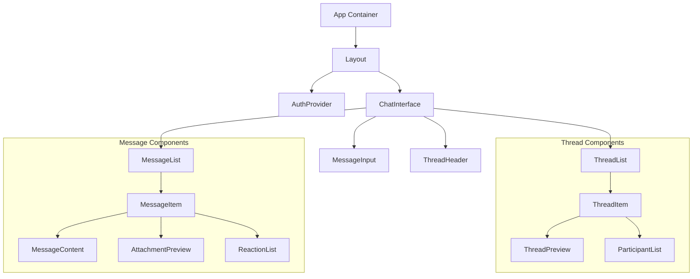

# Component Documentation

## Component Architecture



## Core Components

### ChatInterface
Primary container for the chat functionality.

```typescript
import { Thread, Message } from '@/types';

export function ChatInterface({ thread, onThreadUpdate }: ChatInterfaceProps) {
  const socket = useSocket();
  const [messages, setMessages] = useState<Message[]>([]);
  const [isLoadingMore, setIsLoadingMore] = useState(false);
  
  // Socket event handlers
  useEffect(() => {
    if (!socket || !thread.id) return;
    
    socket.emit('thread:join', { threadId: thread.id });
    socket.on('message:new', handleNewMessage);
    socket.on('message:update', handleMessageUpdate);
    
    return () => {
      socket.emit('thread:leave', { threadId: thread.id });
      socket.off('message:new', handleNewMessage);
      socket.off('message:update', handleMessageUpdate);
    };
  }, [socket, thread.id]);

  // Implementation details...
}
```

### ThreadList
Displays and manages chat threads.

```typescript
export function ThreadList({ threads, activeId, onThreadSelect }: ThreadListProps) {
  const sortedThreads = useMemo(() => 
    [...threads].sort((a, b) => 
      (b.lastMessageAt?.getTime() ?? 0) - (a.lastMessageAt?.getTime() ?? 0)
    ),
    [threads]
  );

  // Virtual list implementation for performance
  const rowVirtualizer = useVirtualizer({
    count: sortedThreads.length,
    getScrollElement: () => scrollElementRef.current,
    estimateSize: () => 72,
    overscan: 5,
  });

  // Implementation details...
}
```

### MessageList
Handles message display and interactions.

```typescript
export function MessageList({ messages, loading, hasMore, onLoadMore }: MessageListProps) {
  const messagesEndRef = useRef<HTMLDivElement>(null);
  const [isNearBottom, setIsNearBottom] = useState(true);
  
  // Auto-scroll logic
  useEffect(() => {
    if (isNearBottom) {
      messagesEndRef.current?.scrollIntoView({ behavior: 'smooth' });
    }
  }, [messages, isNearBottom]);

  // Infinite scroll implementation
  const handleScroll = useCallback((e: UIEvent<HTMLDivElement>) => {
    const target = e.target as HTMLDivElement;
    const isNearTop = target.scrollTop < 100;
    
    if (isNearTop && !loading && hasMore) {
      onLoadMore?.();
    }
  }, [loading, hasMore, onLoadMore]);

  // Implementation details...
}
```

### MessageInput
Handles message composition and sending.

```typescript
export function MessageInput({ threadId, onSend, onTyping }: MessageInputProps) {
  const [content, setContent] = useState('');
  const [attachments, setAttachments] = useState<File[]>([]);
  const [isUploading, setIsUploading] = useState(false);
  
  // Typing indicator debounce
  const debouncedTyping = useCallback(
    debounce(() => onTyping?.(), 500),
    [onTyping]
  );

  // File upload handling
  const handleFileSelect = async (files: FileList) => {
    setIsUploading(true);
    try {
      const uploadedFiles = await Promise.all(
        Array.from(files).map(uploadFile)
      );
      setAttachments(prev => [...prev, ...uploadedFiles]);
    } finally {
      setIsUploading(false);
    }
  };

  // Implementation details...
}
```

## Supporting Components

### ThreadItem
Individual thread list item with preview.

```typescript
export function ThreadItem({ thread, isActive, onClick }: ThreadItemProps) {
  const { participants, lastMessage } = thread;
  const unreadCount = useUnreadCount(thread.id);
  
  const previewText = useMemo(() => {
    if (!lastMessage) return '';
    return lastMessage.content.length > 50
      ? `${lastMessage.content.slice(0, 50)}...`
      : lastMessage.content;
  }, [lastMessage]);

  // Implementation details...
}
```

### MessageItem
Individual message display component.

```typescript
export function MessageItem({ message, onAction }: MessageItemProps) {
  const { user } = useAuth();
  const isOwn = message.userId === user?.id;
  const [showActions, setShowActions] = useState(false);
  
  const handleEdit = async (newContent: string) => {
    try {
      await onAction?.('edit', { content: newContent });
    } catch (error) {
      // Error handling...
    }
  };

  // Implementation details...
}
```

## Hooks and Utilities

### useSocket
WebSocket connection management hook.

```typescript
export function useSocket() {
  const socket = useRef<Socket>();
  const { token } = useAuth();
  
  useEffect(() => {
    if (!token) return;
    
    socket.current = io({
      auth: { token },
      reconnection: true,
      reconnectionDelay: 1000,
      reconnectionAttempts: 5,
    });
    
    return () => {
      socket.current?.disconnect();
    };
  }, [token]);

  return socket.current;
}
```

### useMessages
Message management hook.

```typescript
export function useMessages(threadId: string) {
  const [messages, setMessages] = useState<Message[]>([]);
  const [loading, setLoading] = useState(false);
  const [hasMore, setHasMore] = useState(true);
  
  const loadMore = useCallback(async () => {
    if (loading || !hasMore) return;
    setLoading(true);
    try {
      const olderMessages = await fetchMessages(threadId, {
        before: messages[0]?.id,
        limit: 50,
      });
      setMessages(prev => [...olderMessages, ...prev]);
      setHasMore(olderMessages.length === 50);
    } finally {
      setLoading(false);
    }
  }, [threadId, messages, loading, hasMore]);

  // Implementation details...
}
```

## State Management

### Thread Context
```typescript
const ThreadContext = createContext<ThreadContextValue>(null!);

export function ThreadProvider({ children }: PropsWithChildren) {
  const [threads, setThreads] = useState<Thread[]>([]);
  const [activeThread, setActiveThread] = useState<string | null>(null);
  
  const addThread = useCallback((thread: Thread) => {
    setThreads(prev => [thread, ...prev]);
  }, []);
  
  const updateThread = useCallback((threadId: string, updates: Partial<Thread>) => {
    setThreads(prev => prev.map(t => 
      t.id === threadId ? { ...t, ...updates } : t
    ));
  }, []);

  // Implementation details...
}
```

## Performance Optimizations

1. Virtual Lists
   - Used for thread and message lists
   - Only renders visible items
   - Smooth scrolling performance

2. Memoization
   - Heavy computations wrapped in useMemo
   - Event handlers stabilized with useCallback
   - Props passed to child components minimized

3. Lazy Loading
   - Images and attachments loaded on demand
   - Message history fetched in chunks
   - Components split into loadable chunks

4. State Management
   - Local state for UI components
   - Context for shared state
   - Optimistic updates for better UX 