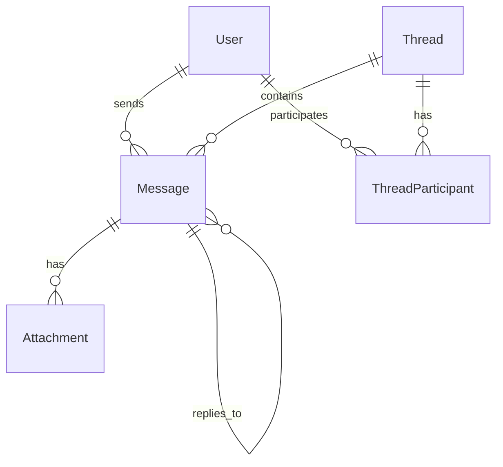

# Database Documentation

## Schema Overview



## Core Tables

### Users
```sql
CREATE TABLE users (
  id UUID PRIMARY KEY DEFAULT uuid_generate_v4(),
  email VARCHAR(255) UNIQUE NOT NULL,
  username VARCHAR(50) UNIQUE NOT NULL,
  first_name VARCHAR(100),
  last_name VARCHAR(100),
  profile_image VARCHAR(255),
  is_active BOOLEAN DEFAULT true,
  last_login_at TIMESTAMP,
  created_at TIMESTAMP DEFAULT CURRENT_TIMESTAMP,
  updated_at TIMESTAMP DEFAULT CURRENT_TIMESTAMP
);

-- Indexes
CREATE INDEX idx_users_email ON users(email);
CREATE INDEX idx_users_username ON users(username);
```

### Threads
```sql
CREATE TABLE threads (
  id UUID PRIMARY KEY DEFAULT uuid_generate_v4(),
  name VARCHAR(255),
  is_direct BOOLEAN DEFAULT false,
  is_archived BOOLEAN DEFAULT false,
  last_message_at TIMESTAMP,
  created_at TIMESTAMP DEFAULT CURRENT_TIMESTAMP,
  updated_at TIMESTAMP DEFAULT CURRENT_TIMESTAMP
);

-- Indexes
CREATE INDEX idx_threads_last_message ON threads(last_message_at DESC);
```

### Messages
```sql
CREATE TABLE messages (
  id UUID PRIMARY KEY DEFAULT uuid_generate_v4(),
  thread_id UUID NOT NULL REFERENCES threads(id) ON DELETE CASCADE,
  user_id UUID NOT NULL REFERENCES users(id) ON DELETE CASCADE,
  content TEXT NOT NULL,
  parent_id UUID REFERENCES messages(id) ON DELETE SET NULL,
  status VARCHAR(20) DEFAULT 'sent',
  metadata JSONB,
  created_at TIMESTAMP DEFAULT CURRENT_TIMESTAMP,
  updated_at TIMESTAMP DEFAULT CURRENT_TIMESTAMP
);

-- Indexes
CREATE INDEX idx_messages_thread ON messages(thread_id, created_at DESC);
CREATE INDEX idx_messages_user ON messages(user_id, created_at DESC);
CREATE INDEX idx_messages_parent ON messages(parent_id);
CREATE INDEX idx_messages_metadata ON messages USING gin (metadata);
```

## Query Optimization

### Common Queries

1. Thread List
```sql
SELECT t.*, 
       COUNT(DISTINCT tp.user_id) as participant_count,
       COUNT(DISTINCT m.id) as message_count,
       COUNT(DISTINCT CASE WHEN m.created_at > :last_read THEN m.id END) as unread_count
FROM threads t
LEFT JOIN thread_participants tp ON tp.thread_id = t.id
LEFT JOIN messages m ON m.thread_id = t.id
WHERE t.id IN (
  SELECT thread_id 
  FROM thread_participants 
  WHERE user_id = :user_id
)
GROUP BY t.id
ORDER BY t.last_message_at DESC
LIMIT :limit OFFSET :offset;
```

2. Message History
```sql
SELECT m.*,
       u.username,
       u.profile_image,
       COUNT(a.id) as attachment_count
FROM messages m
JOIN users u ON u.id = m.user_id
LEFT JOIN attachments a ON a.message_id = m.id
WHERE m.thread_id = :thread_id
  AND m.created_at < :before
GROUP BY m.id, u.id
ORDER BY m.created_at DESC
LIMIT :limit;
```

### Performance Tips

1. Use Prepared Statements
```typescript
const getThread = db.$queryRaw`
  SELECT * FROM threads 
  WHERE id = ${threadId}
  FOR UPDATE;
`;
```

2. Batch Operations
```typescript
const createMessages = async (messages: Message[]) => {
  await db.$transaction(
    messages.map(msg => 
      db.message.create({ data: msg })
    )
  );
};
```

3. Connection Pooling
```typescript
const pool = new Pool({
  max: 20,
  idleTimeoutMillis: 30000,
  connectionTimeoutMillis: 2000,
});
```

## Data Migration

### Migration Scripts

```typescript
// migrations/001_initial_schema.ts
export async function up(db: Prisma.TransactionClient) {
  await db.$executeRaw`
    CREATE TABLE users (
      id UUID PRIMARY KEY DEFAULT uuid_generate_v4(),
      -- ... other fields
    );
  `;
}

export async function down(db: Prisma.TransactionClient) {
  await db.$executeRaw`
    DROP TABLE IF EXISTS users CASCADE;
  `;
}
```

### Migration Process

1. Generate Migration
```bash
npx prisma migrate dev --name migration_name
```

2. Apply Migration
```bash
npx prisma migrate deploy
```

3. Rollback Strategy
```typescript
async function rollback(migrationId: string) {
  await db.$executeRaw`
    SELECT rollback_migration(${migrationId});
  `;
}
```

## Monitoring

### Health Checks

```sql
-- Basic connectivity
SELECT 1;

-- Connection count
SELECT count(*), state 
FROM pg_stat_activity 
GROUP BY state;

-- Lock information
SELECT relation::regclass, mode, granted
FROM pg_locks l 
JOIN pg_stat_activity a ON l.pid = a.pid;
```

### Performance Metrics

1. Query Statistics
```sql
SELECT queryid, 
       calls, 
       total_time / calls as avg_time,
       rows / calls as avg_rows
FROM pg_stat_statements
ORDER BY total_time DESC
LIMIT 10;
```

2. Index Usage
```sql
SELECT schemaname, tablename, indexname, idx_scan, idx_tup_read
FROM pg_stat_user_indexes
ORDER BY idx_scan DESC;
```

3. Table Statistics
```sql
SELECT relname, seq_scan, idx_scan, n_tup_ins, n_tup_upd, n_tup_del
FROM pg_stat_user_tables;
```

## Backup and Recovery

### Backup Strategy

1. Physical Backup
```bash
pg_basebackup -D backup -Ft -z -P
```

2. Logical Backup
```bash
pg_dump dbname > backup.sql
```

3. Point-in-Time Recovery
```sql
RESTORE DATABASE chatapp 
FROM '/path/to/backup' 
WITH RECOVERY_TARGET_TIME = '2024-01-01 00:00:00';
```

### Maintenance

1. Vacuum
```sql
VACUUM ANALYZE messages;
```

2. Reindex
```sql
REINDEX TABLE messages;
```

3. Update Statistics
```sql
ANALYZE messages;
```

## Security

### Access Control

1. Role-Based Access
```sql
CREATE ROLE app_user;
GRANT SELECT, INSERT ON messages TO app_user;
```

2. Row-Level Security
```sql
ALTER TABLE messages ENABLE ROW LEVEL SECURITY;

CREATE POLICY message_access ON messages
  USING (user_id = current_user_id());
```

### Encryption

1. Column Encryption
```sql
CREATE EXTENSION pgcrypto;

CREATE OR REPLACE FUNCTION encrypt_message() 
RETURNS trigger AS $$
BEGIN
  NEW.content = pgp_sym_encrypt(
    NEW.content, 
    current_setting('app.encryption_key')
  );
  RETURN NEW;
END;
$$ LANGUAGE plpgsql;
```

2. Secure Connections
```typescript
const pool = new Pool({
  ssl: {
    rejectUnauthorized: true,
    ca: fs.readFileSync('/path/to/ca.crt'),
  },
});
``` 