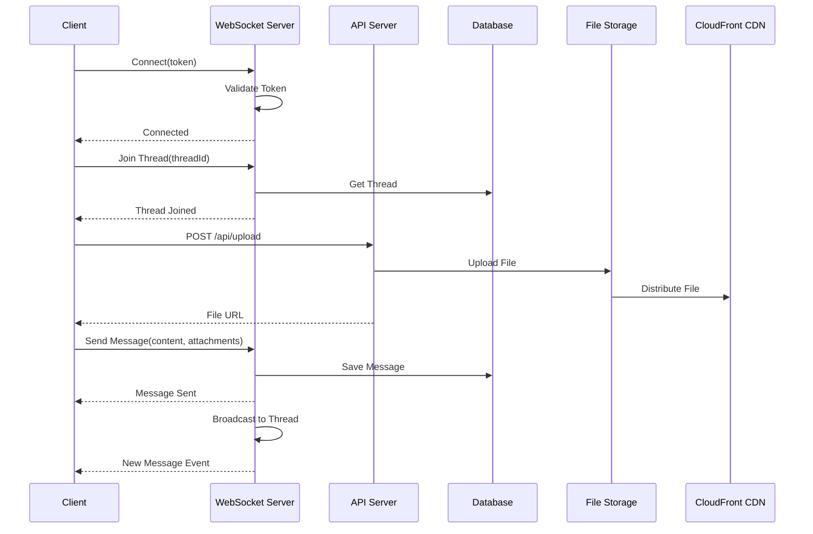
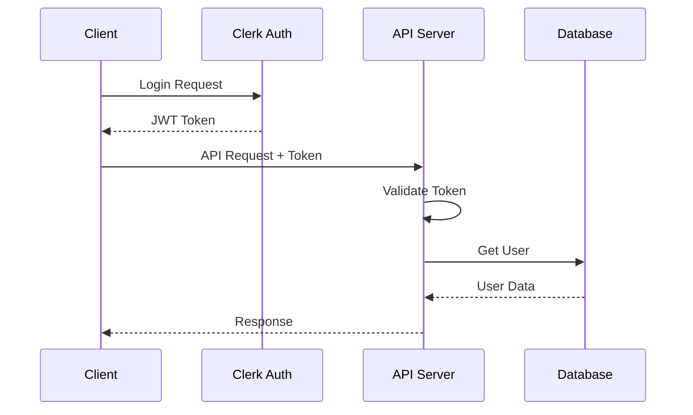
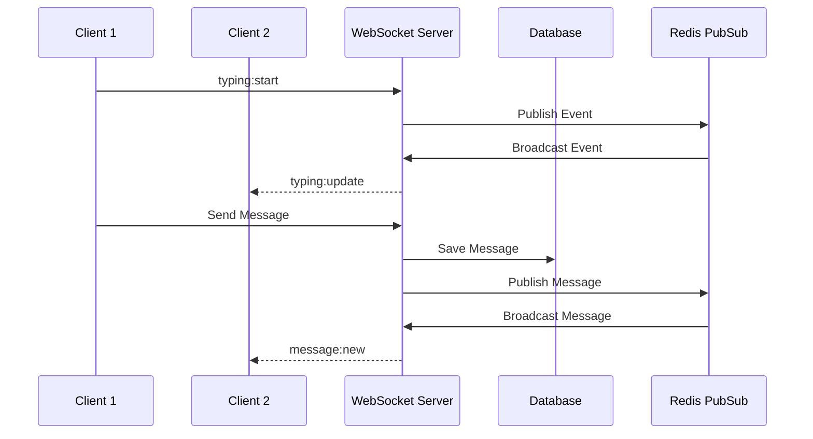
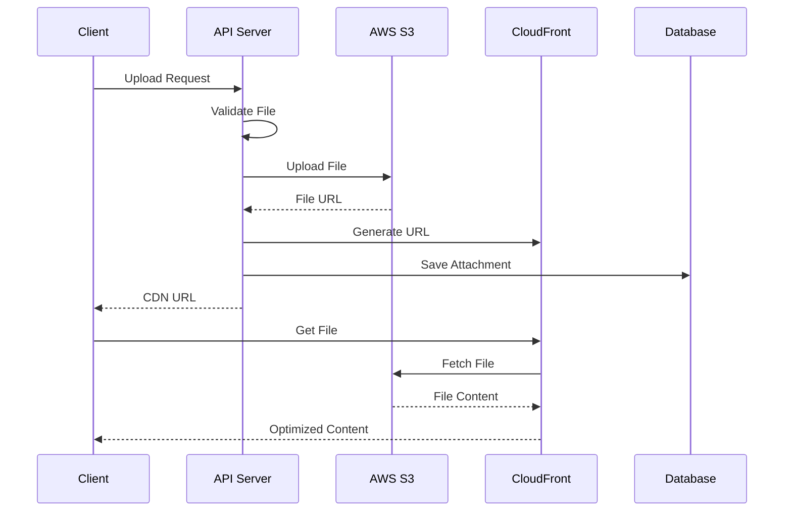
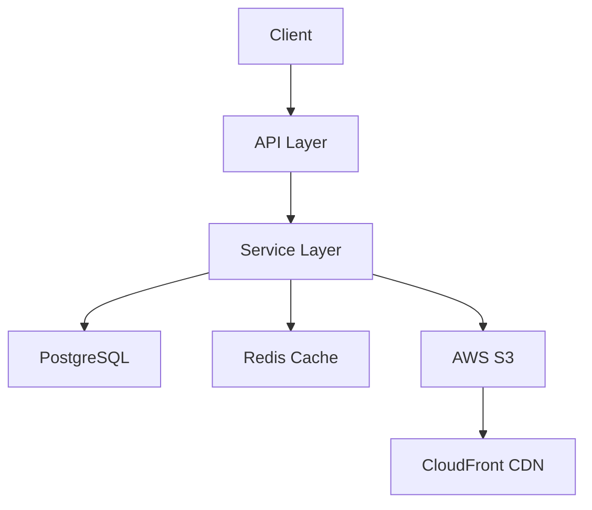
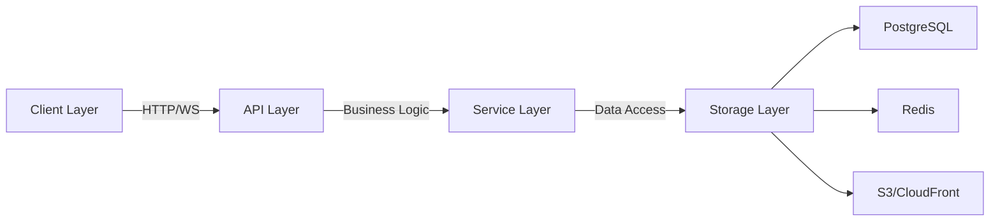

# Sequence Diagrams

This document contains sequence diagrams illustrating key flows in the chat application.

## Message Flow

## Authentication Flow

## Real-time Updates Flow

## File Handling Flow

## Data Storage Hierarchy

## Key Components

