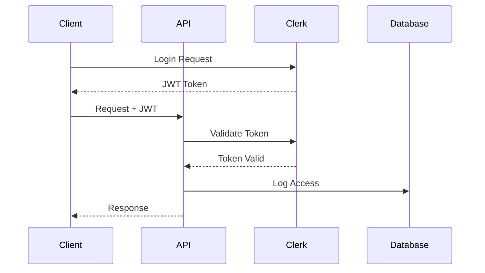

# Security Implementation Guide

## Overview

This document provides a comprehensive guide to the security implementation across the application.

## Authentication

### 1. User Authentication Flow



### 2. Token Management

```typescript
interface TokenConfig {
  accessToken: {
    expiryMinutes: number;
    secret: string;
  };
  refreshToken: {
    expiryDays: number;
    secret: string;
  };
}

const tokenConfig: TokenConfig = {
  accessToken: {
    expiryMinutes: 15,
    secret: process.env.JWT_SECRET!,
  },
  refreshToken: {
    expiryDays: 7,
    secret: process.env.REFRESH_TOKEN_SECRET!,
  },
};
```

### 3. Session Management

```typescript
interface SessionConfig {
  maxActiveSessions: number;
  sessionTimeout: number;
  refreshThreshold: number;
}

const sessionConfig: SessionConfig = {
  maxActiveSessions: 5,
  sessionTimeout: 24 * 60 * 60, // 24 hours
  refreshThreshold: 15 * 60,    // 15 minutes
};
```

## Authorization

### 1. Role-Based Access Control

```typescript
enum UserRole {
  ADMIN = 'admin',
  MODERATOR = 'moderator',
  USER = 'user',
  GUEST = 'guest',
}

const rolePermissions: Record<UserRole, string[]> = {
  [UserRole.ADMIN]: ['*'],
  [UserRole.MODERATOR]: [
    'thread:read',
    'thread:write',
    'message:read',
    'message:write',
    'message:delete',
  ],
  [UserRole.USER]: [
    'thread:read',
    'thread:write',
    'message:read',
    'message:write',
  ],
  [UserRole.GUEST]: [
    'thread:read',
    'message:read',
  ],
};
```

### 2. Resource Access Control

```typescript
interface ResourceAccess {
  canView: boolean;
  canEdit: boolean;
  canDelete: boolean;
  additionalPermissions?: Record<string, boolean>;
}

async function getResourceAccess(
  userId: string,
  resourceType: string,
  resourceId: string
): Promise<ResourceAccess> {
  const user = await getUser(userId);
  const resource = await getResource(resourceType, resourceId);
  const roles = await getUserRoles(userId);

  return {
    canView: hasPermission(roles, `${resourceType}:read`),
    canEdit: hasPermission(roles, `${resourceType}:write`),
    canDelete: hasPermission(roles, `${resourceType}:delete`),
  };
}
```

## Data Protection

### 1. Encryption

```typescript
interface EncryptionConfig {
  algorithm: string;
  keySize: number;
  ivSize: number;
}

const encryptionConfig: EncryptionConfig = {
  algorithm: 'aes-256-gcm',
  keySize: 32,
  ivSize: 16,
};

async function encryptMessage(content: string): Promise<EncryptedData> {
  const iv = crypto.randomBytes(encryptionConfig.ivSize);
  const cipher = crypto.createCipheriv(
    encryptionConfig.algorithm,
    await getEncryptionKey(),
    iv
  );

  const encrypted = Buffer.concat([
    cipher.update(content, 'utf8'),
    cipher.final(),
  ]);

  return {
    data: encrypted.toString('base64'),
    iv: iv.toString('base64'),
    tag: cipher.getAuthTag().toString('base64'),
  };
}
```

### 2. Data Masking

```typescript
const maskingRules: Record<string, RegExp> = {
  email: /^(.{2})(.*)(@.*)$/,
  phone: /^(\+\d{2})?(.*)(\d{4})$/,
  name: /^(.{1})(.*)(.{1})$/,
};

function maskSensitiveData(
  data: string,
  type: keyof typeof maskingRules
): string {
  const rule = maskingRules[type];
  return data.replace(rule, (_, start, middle, end) => 
    `${start}${'*'.repeat(middle.length)}${end}`
  );
}
```

## Security Headers

```typescript
// middleware/security.ts
export const securityHeaders = {
  'Strict-Transport-Security': 'max-age=31536000; includeSubDomains',
  'X-Frame-Options': 'DENY',
  'X-Content-Type-Options': 'nosniff',
  'Referrer-Policy': 'strict-origin-when-cross-origin',
  'Content-Security-Policy': [
    "default-src 'self'",
    "script-src 'self' 'unsafe-inline' 'unsafe-eval'",
    "style-src 'self' 'unsafe-inline'",
    "img-src 'self' data: https:",
    "connect-src 'self' wss:",
  ].join('; '),
  'X-XSS-Protection': '1; mode=block',
};
```

## Rate Limiting

```typescript
interface RateLimitConfig {
  window: string;
  max: number;
  message: string;
}

const rateLimits: Record<string, RateLimitConfig> = {
  login: {
    window: '15m',
    max: 5,
    message: 'Too many login attempts',
  },
  api: {
    window: '1m',
    max: 60,
    message: 'Too many requests',
  },
  websocket: {
    window: '1m',
    max: 100,
    message: 'Too many socket events',
  },
};
```

## Audit Logging

```typescript
interface AuditLog {
  timestamp: Date;
  userId: string;
  action: string;
  resource: string;
  success: boolean;
  metadata: {
    ip: string;
    userAgent: string;
    changes?: Record<string, any>;
  };
}

async function logAuditEvent(event: Omit<AuditLog, 'timestamp'>): Promise<void> {
  await db.auditLog.create({
    data: {
      ...event,
      timestamp: new Date(),
    },
  });
}
```

## Security Monitoring

### 1. Event Monitoring

```typescript
interface SecurityEvent {
  type: 'auth' | 'access' | 'data' | 'error';
  severity: 'low' | 'medium' | 'high' | 'critical';
  message: string;
  metadata: Record<string, any>;
}

const securityThresholds = {
  failedLogins: {
    window: '15m',
    threshold: 5,
    action: 'block',
  },
  suspiciousAccess: {
    window: '1h',
    threshold: 10,
    action: 'alert',
  },
};
```

### 2. Alerts

```typescript
interface AlertConfig {
  channels: {
    email: string[];
    slack: string;
    webhook?: string;
  };
  thresholds: {
    [K in SecurityEvent['severity']]: number;
  };
}

async function handleSecurityEvent(event: SecurityEvent): Promise<void> {
  await logSecurityEvent(event);
  
  if (event.severity === 'high' || event.severity === 'critical') {
    await sendAlerts(event);
  }
  
  if (requiresAction(event)) {
    await takeAutomatedAction(event);
  }
}
```

## Incident Response

### 1. Account Lockout

```typescript
async function lockAccount(userId: string, reason: string): Promise<void> {
  await db.$transaction([
    db.user.update({
      where: { id: userId },
      data: { isLocked: true, lockReason: reason },
    }),
    db.session.deleteMany({
      where: { userId },
    }),
    logAuditEvent({
      userId,
      action: 'account_lock',
      resource: 'user',
      success: true,
      metadata: { reason },
    }),
  ]);
}
```

### 2. Session Invalidation

```typescript
async function invalidateSessions(
  userId: string,
  reason: string
): Promise<void> {
  await db.$transaction([
    db.session.deleteMany({
      where: { userId },
    }),
    db.token.updateMany({
      where: { userId },
      data: { isRevoked: true },
    }),
    logAuditEvent({
      userId,
      action: 'session_invalidation',
      resource: 'session',
      success: true,
      metadata: { reason },
    }),
  ]);
}
``` 