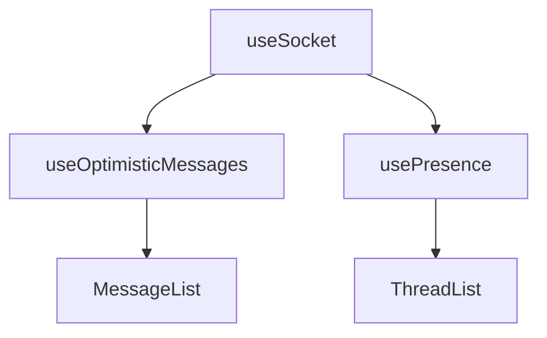

# Custom Hooks

## Overview



## useSocket

Manages WebSocket connections and real-time events.

### Features
- Auto-connection management
- Type-safe event handling
- Error handling
- Connection state tracking

### Usage
```typescript
const { socket, isConnected } = useSocket();

useEffect(() => {
  if (socket) {
    socket.on('message:new', handleNewMessage);
    return () => socket.off('message:new');
  }
}, [socket]);
```

### Events
```typescript
// Client to Server
'message:send'
'typing:start'
'typing:stop'
'presence:ping'

// Server to Client
'message:new'
'message:updated'
'message:deleted'
'typing:update'
'presence:pong'
```

## useOptimisticMessages

Manages optimistic updates for messages.

### Features
- Instant message display
- Status tracking
- Error handling
- Retry functionality

### Usage
```typescript
const {
  messages,
  addOptimisticMessage,
  updateOptimisticMessage,
  markMessageError
} = useOptimisticMessages();

const sendMessage = async (content: string) => {
  const tempId = addOptimisticMessage(content, userId, threadId);
  try {
    const message = await sendToServer(content);
    updateOptimisticMessage(tempId, message);
  } catch (error) {
    markMessageError(tempId, error.message);
  }
};
```

### Message States
- SENDING
- SENT
- DELIVERED
- FAILED

## Common Patterns

### Error Handling
```typescript
try {
  // Optimistic update
  const tempId = addOptimisticMessage(...);
  
  // Server operation
  const result = await serverOperation();
  
  // Success update
  updateOptimisticMessage(tempId, result);
} catch (error) {
  // Error handling
  markMessageError(tempId, error.message);
  
  // Optional retry
  markMessageRetrying(tempId);
}
```

### Cleanup
```typescript
useEffect(() => {
  // Setup
  socket?.on('event', handler);
  
  // Cleanup
  return () => {
    socket?.off('event');
    cleanup();
  };
}, [dependencies]);
```

## Dependencies

- socket.io-client for WebSocket
- nanoid for temporary IDs
- React's useState/useCallback 