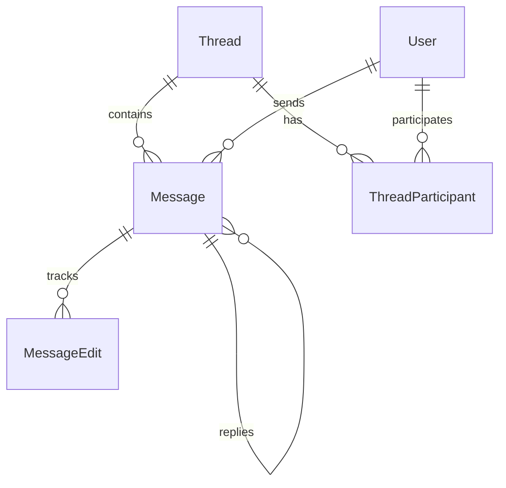

# Chat Application Data Model

## Core Models

## Key Design Decisions

### Message Threading
- Messages belong to a single thread
- Optional parent-child relationships for replies
- Edit history tracked separately for audit
- Soft deletion with status field

### Thread Management
- Supports both 1:1 and group chats
- Participants tracked with composite key
- Cascade deletions for cleanup
- Status tracking for archiving

### Performance Optimizations

#### Indexes
- `(threadId, createdAt)` for message retrieval
- `(userId, threadId)` for participant lookups
- `parentId` for reply chains
- `status` for message filtering

#### Constraints
- Foreign key cascades for referential integrity
- Unique composite keys for thread participants
- Check constraints on message length/status

## Schema Evolution

The schema is designed to support future features:
- Message reactions (via separate table)
- Rich media attachments
- Thread categorization
- Message threading beyond simple replies

For implementation details, see:
- `prisma/schema.prisma` - Full schema definition
- `lib/validation/` - Data validation rules
- `lib/db/` - Database operations 